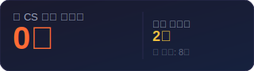

# cs-quiz-note

매일 아침 CS 기술면접 퀴즈를 기록하는 저장소입니다.

## 📅 주제 순환
자료구조 → 알고리즘 → 운영체제 → 네트워크 → 데이터베이스 → 디자인패턴

## 🔥 스트릭

| 항목 | 값 |
|------|-----|
| 현재 스트릭 | 0일 |
| 최장 스트릭 | 8일 |
| 마지막 퀴즈 | 2026-05-30 |
| 총 퀴즈 수 | 9개 |

## 📅 2026년 5월

| 일 | 월 | 화 | 수 | 목 | 금 | 토 |
|:---:|:---:|:---:|:---:|:---:|:---:|:---:|
|  |  |  |  |  | 1 | 2 |
| 3 | 4 | 5 | 6 | 7 | 8 | 9 |
| 10 | 11 | 12 | 13 | 14 | 15 | 16 |
| 17 | 18 | 19 | ✅20 | ✅21 | 22 | ✅23 |
| ✅24 | 25 | ✅26 | ✅27 | ✅28 | ✅29 | ⬜30 |
| 31 |  |  |  |  |  |  |

> ✅ 정답 제출 | ❌ 오답 | ⬜ 미제출

## 📂 퀴즈 목록

### 2026년 5월
- [2026-05-20 - 알고리즘](quizzes/2026/05/2026-05-20.md)
- [2026-05-21 - 운영체제](quizzes/2026/05/2026-05-21.md)
- [2026-05-23 - DB](quizzes/2026/05/2026-05-23.md)
- [2026-05-24 - 디자인패턴](quizzes/2026/05/2026-05-24.md)
- [2026-05-26 - 자료구조](quizzes/2026/05/2026-05-26.md)
- [2026-05-27 - 알고리즘](quizzes/2026/05/2026-05-27.md)
- [2026-05-28 - 운영체제](quizzes/2026/05/2026-05-28.md)
- [2026-05-29 - 네트워크](quizzes/2026/05/2026-05-29.md)
- [2026-05-30 - DB](quizzes/2026/05/2026-05-30.md)
